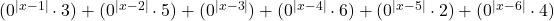

+++
title = "Brute Force Maths, Solving Any Dice"
date = "2024-05-25"
tags = ["math", "dice", "puzzles"]
+++

While trying to solve the opposing face for what I’ve dubbed as “Butterfly” configured dice, I had a bit of an epiphany and realised all my recent dice problems could be brute forced by exploiting zero to a power, that 00 equals 1 but 0¹ ᵒʳ ᵍʳᵉᵃᵗᵉʳ equals 0 allows us to essentially conditionally select what result we get from an input. The trick gives us an If statement without the notation, we can cheat around my self imposed no-ifs rule.

My [previous monster equation for solving Turned Dice]() can be reduced to following;

Similar treatment with a slightly reworked equation can be used to solve Butterfly Dice too;

(The absolute values of exponents are being used because negative exponents would require dividing by zero, which is impossible.)

|  |  | 
|:--:|:--:|
| The net of a _butterfly dice_ | The pattern of a _butterfly dice_ |

This brute forcing is very cool, but it’s left me feeling a bit foolish and embarrassed for putting in such effort on the behemoth equation before. Forcing it like this feels very on the nose and “if this then that”, but it’s far more simple and clean – I got my wish – I suppose.