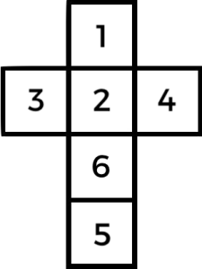
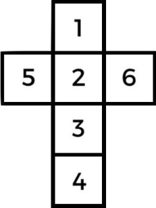

+++
title = "Oddly Configured Dice; Finding the Opposing Face"
date = "2024-02-09"
tags = ["math", "dice", "puzzles"]
+++

On common six sided dice, all opposing faces add to seven (this configuration is called “sevens”). Knowing this, you can always find the value of the opposing face with the simple equation; _7 – x_ = _y_, where _x_ is the known face and _y_ is the opposing.

<!--more-->

For all faces, we have the following equations;

    7 - x = y
    7 - 1 = 6
    7 - 2 = 5
    7 - 3 = 4
    7 - 4 = 3
    7 - 5 = 2
    7 - 6 = 1

|  | 
|:--|
| The net of a sevens configured dice |

### Prime Configured Dice

However, not all dice are sevens configured, in ancient times dice were often “primes”, or prime configured. These prime configured dice have opposing faces which add to the distinct primes three, five and eleven. This works by one opposing two, making three; three opposing four making five; five opposing six making eleven.

The means for calculating this when spoken is fairly simple; if the known face is odd, then add one, otherwise, if known face is even then subtract one.

|  | 
|:--|
| The net of a primes configured dice |

However, writing this in pretty maths is less easy, my current best attempt is;

    (x - 1) + 2(x mod 2) = y
    (1 - 1) + 2(1 mod 2) = 2
    (2 - 1) + 2(2 mod 2) = 1
    (3 - 1) + 2(3 mod 2) = 4
    (4 - 1) + 2(4 mod 2) = 3
    (5 - 1) + 2(5 mod 2) = 6
    (6 - 1) + 2(6 mod 2) = 5

It’s worth noting that I loathe using conditionals in equations, I’ve deliberately gone out my way to avoid them. There is great joy to be won finding equations that work without any _ifs_ or branching. I like a solid machine with no moving parts.

### Turned Dice

A “turned” dice is trickier to conceptualise it’s faces pair as 1-3, 2-4 and 5-6. With exception of five and six the faces run sequentially along one rotational axis. If you’re having trouble thinking about it, grab a nearby trusty cube and hold your fingers against the faces to visualise how one to four spiral around one axis.

Unlike sevens and primes dice we don’t have a regular difference to exploit between the opposing faces (|x-7| and x±1 respectively). Nor is the odd/even pattern of the primes found here either. Finding an equation to find the opposing face on a turned dice is far trickier.

|  | 
|:--:|
| The net of a turned configured dice |

With turned dice, we know the following statements are true;

1.  The difference is always ±2 except for five and six, theirs is ±1.
2.  Five and six are the only mixed odd-even pairing.
3.  It seemingly follows two patterns and is just awful to think about.

Anyway, after a great deal of thought and madness and doubts there was a means to produce such an equation without conditional elements, I managed to spit out the following nightmare;

|  | 
|:--:|
| One condition free solution to turned dice |

What’s happening here is roughly the following;

1.  We perform the same equation to solve our Primes dice, this immediately lets us solve five and six.
2.  We multiply this by _z(x) + .._ this keeps five and six solved, since _z_ proves 1 when five and six are offered.
3.  To solve the others we again use the _z_ function, but negate it, so everything becomes 1 except for five and six, which become 0.
4.  Then with this found 1, we traverse 2 indexes around a looping set of {one, two, three, four}, for example; one becomes three and three becomes one, four becomes two. It wraps around. We multiply this by our second use of the _z_ function, which when inverted only affects numbers under five.
5.  This multiplied number is then added to the left side. For five and six, it’s zero plus six and five, respectively. For the others it is also their opposing faces.

Finding this solution took a fair amount of time, at times I wasn’t certain it could be done without conditionals. I’m glad I didn’t give up.

I’m fully expecting there to be a far, far better way to solve Turned Dice, I wouldn’t call myself a mathematician by any stretch. I’m sure there’s someone out there who could put this to shame.

Nonetheless. The messy equation above is just my first attempt at the conundrum of turned dice, I can only hope my future endeavours are a little neater.

## Update; Left Handed & a Tidier Solution Found

This post was followed up by one exploring how to find the [left handed version of it](), then later I got my wish and found a far cleaner solution to the entire problem; [brute force]().

### Further Reading

You can read the history of Sevens, Primes and Turned dice in the fantastic paper; [The Evolution of Cubic Dice: From the Roman Through Post-Medieval Period in the Netherlands](https://www.researchgate.net/publication/322466782_The_Evolution_of_Cubic_Dice_from_the_Roman_through_Post-Medieval_Period_in_the_Netherlands) \[[PDF](https://www.researchgate.net/profile/Jelmer-Eerkens/publication/322466782_The_Evolution_of_Cubic_Dice_from_the_Roman_through_Post-Medieval_Period_in_the_Netherlands/links/5a5fb4fdaca2727352441292/The-Evolution-of-Cubic-Dice-From-the-Roman-Through-Post-Medieval-Period-in-the-Netherlands.pdf)\] by _Jelmer W. Eerkens, University of California, Davis_ and _Alex de Voogt, Drew University_. The paper also covers the United Kingdom, despite the title.

I wrote and tested these equations using Javascript, and then used the excellent [Text2Latex](https://www.text2latex.com/) and [QuickLatex](https://www.quicklatex.com/) tools to quickly convert them to mathematical notation. These tools do a great job but be sure to check nothings been mangled by the machine ghosts.