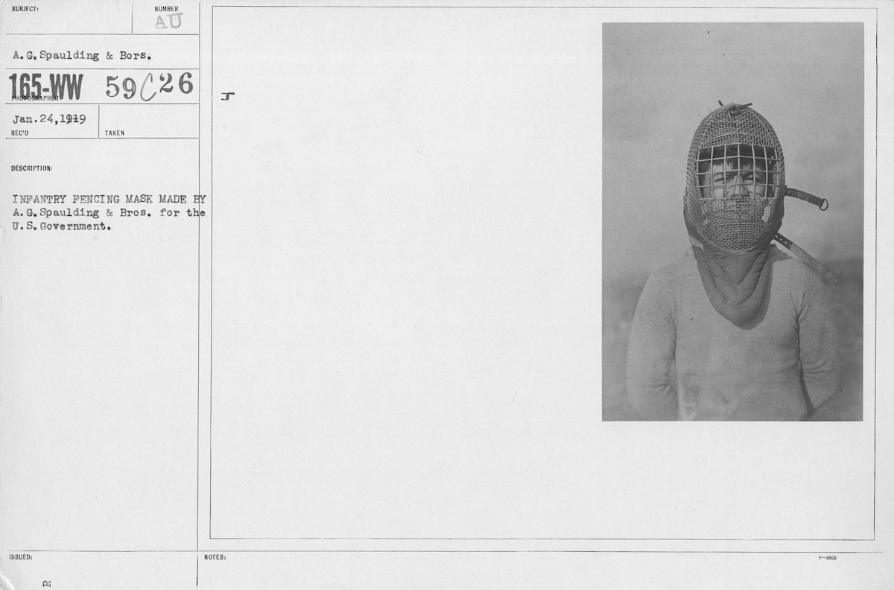

+++
title = "Fencing Masks for U.S. Infantry & Cavalry, circa 1919"
date = "2023-01-19"
tags = ["history", "fencing", "military", "equipment"]
+++

Sometime shortly before January 24, 1919, the A.G. Spalding Brothers Company developed fencing masks for the U.S. Government. Two masks are recorded in the National Archives, one for infantry and one cavalry, a front and side view is presented for each.

Curiously it is the cavalry mask which bears the best resemblance to the modern fencing masks we’re familiar with nowadays. It also offers the best protection, while contrastingly the infantry mask offers better visual fidelity – at expense of eye cover.

The collection can be viewed in high resolution at the [U.S. National Archives here](https://catalog.archives.gov/id/20797228).

|  |  |
|---|---|
|  |  |
