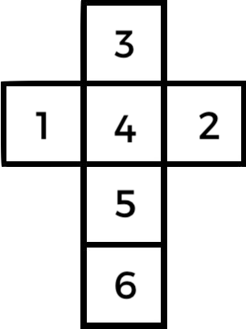

+++
title = "Solving “Left Handed” Turned Dice"
date = "2024-05-22"
tags = ["math", "dice", "puzzles", "history"]
+++

Revisiting my [post about solving the opposing face of various dice configurations]() I pondered how a “left handed” turned dice might work. Say rather than placing five and six at the top and bottom of the dice, what if the medieval maker placed one and two in their place, then spiralling around the outside, three, four, five, six? Can we leverage our previous monster of an equation to solve it?

<!--more-->

Yes, we can, by leveraging the equation to solve the classic _Sevens_ configuration dice _(y = 7 – x)_ we are provided the mirror image of a sequence of six sides; 1 2 3 4 5 6 _becomes_ 6 5 4 3 2 1.

A Left Handed Turned Dice (LHTD) is the mirror of a regular, or Right Handed Turned Dice (RHTD);

|  |  | 
|:--:|:--:|
| The net of a left handed turned dice | The net of a right handed turned dice |

The mirroring is hard to see via the medium of nets, but becomes more obvious if you draw the opposing faces as relations instead;

Realising this, we can extend our previous equation to the following, exploiting our ability to mirror arbitrary dice configurations;

