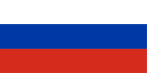

+++
title = "The Mystery Colours of Russia’s 91-93 Flag"
date = "2023-12-26"
tags = ["history", "russia", "flags", "culture"]
+++

[Wikipedia’s flag for Russia 1991 – 1993 has had a decade long edit war](https://en.m.wikipedia.org/w/index.php?title=File:Flag_of_Russia_(1991%E2%80%931993).svg&limit=500), with 58 revisions over which colours should be used.

Some editors are convinced that the colours for the Russian flag in those years was brighter than today’s darker toned flag. Other’s aren’t so convinced, and believe the tones have always been the current darker variant. There’s confusing evidence and usage of both. There’s also a third set of tones which appear to match darker evening variants of the colours, though this kind is seen less often.

For clarity I will be loosely referring to the three tone sets as; 1. The modern darker tones, 2. The purported ’91–’93 tones, 3. The darker evening tones.

|  |  |  | 
|:--:|:--:|:--:|
| Modern darker tones | Purported ’91–’93 tones | Darker evening tones |

[The United Russia party](https://en.wikipedia.org/wiki/United_Russia) (the current ruling party of Russia), currently sports the purported bolder ’91 tones on their logo, but in previous versions used darker tones, and at one point the green-blue evening tones.

|  |  |  | 
|:--:|:--:|:--:|
| All-Russian Party of Unity and Fatherland, merged in 2001, used the modern darker tones | United Russia, 2001–2005, used the even darker evening tones | United Russia, present, uses the purported ’91–’93 tones |

## Azure, Scarlet vs Blue, Red

The confusion seems to stem from the colour names given in the Russian Soviet Federative Socialist Republic (RSFSR)’s 22nd August 1991 decision;

> _Prior to the establishment of the new state symbol of the Russian Federation, the historical flag of Russia – the flag with equal horizontal **white**, **azure**, **scarlet** stripes should be regarded as the official national flag of the Russian Federation._

This was later formally adopted into the constitution on the 11th December 1993 by President Boris Yeltsin, but with different names for the colours;

> _.. a rectangular panel of three equal horizontal stripes: the upper one is **white**, the middle one is **blue** and the lower one is **red**. The ratio of the width of the flag to its length is 2:3_
> 
> Decree No. 2126 “On the State flag of the Russian Federation”, article 1

Putting these colour names into the Pantone Matching System, yields the following results; (The current Government of Russia orders their flags using Pantone colours, _Pantone 286C_ for blue, and _Pantone 485C_ for red. I have also included the named _Red, Blue_ and _Classic Blue_ from Pantone for reference.)

Here we can see some familiar colours to those in the flags and logos above, though no exact match. The mystery continues.

## Doubted Existence

Some commentators online speculate that the existence of the lighter coloured flag is a myth invented by Wikipedians, who have wrongly interpreted the ’91 declaration, but there is _some_ photographic evidence to its existence and use (though these can often be disputed as a trick of the camera).

|  | 
|:--:| 
| Russian soldiers unfold a purported 1991-93 style flag in Grozny in 2000. |

|  | 
|:--:| 
| _Boris Yeltsin & supporters in Moscow appear to fly the lighter flag in ’91, though a secondary photo from a different angle [depicts the same flag in  modern colours](https://www.theguardian.com/world/2016/aug/24/25-years-with-the-soviet-union-25-without-we-want-to-hear-your-stories)._ |

The second photo here is compelling but can easily be dispelled as [other photos from that day show the same physical flag in the more familiar darker colours](https://www.theguardian.com/world/2016/aug/24/25-years-with-the-soviet-union-25-without-we-want-to-hear-your-stories). There’s also [photographic evidence of Yeltsin at formal addresses backdropped by several Russian flags the same year](https://ren.tv/longread/919379-raspad-sssr-khronologiia-poslednego-dnia-sovetskogo-soiuza), all of which hold the modern darker blue.

However, two years later in the 1993 Constitutional Crisis we can see more evidence of the lighter flag in the Supreme Soviet. This lighter variant also [seems to appear on several tanks](https://www.theatlantic.com/international/archive/2013/10/20-years-ago-russia-had-its-biggest-political-crisis-since-the-bolshevik-revolution/280237/), but once again [this cannot be ruled out as a trick of the light](https://www.scripts-berlin.eu/news-events-media/events/2023_Workshop_Russian_Constitutional_Crisis_1993.html).

## Inconclusion

Despite the lack of compelling evidence, I’m still on the fence and defer to the notion that there must be _something_ to the purported lighter version of the flag. I’m certain the flag existed, but to what level of manufacture and usage is unclear.

My personal tastes prefer it more to the current tones used by Russia, though I’m also a big fan of the even rarer darker evening tones.

Much like a lot of history, it’s all a bit of mess. Perhaps states should make like Texas and specify clearly in law which tones they mean;

> (b) The red and blue of the state flag are:  
> (1) the same colors used in the United States flag; and  
> (2) defined as numbers 193 (red) and 281 (dark blue) of the Pantone Matching System.
> 
> [SUBTITLE A. STATE SYMBOLS AND HONORS, CHAPTER 3100. STATE FLAG, SUBCHAPTER A. GENERAL PROVISIONS](https://web.archive.org/web/20071013074003/http://tlo2.tlc.state.tx.us/statutes/docs/GV/content/htm/gv.011.00.003100.00.htm#3100.001.00)

It would certainly clear up some ambiguity.